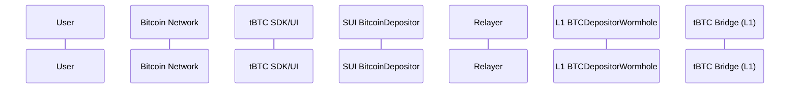

🎨🎨🎨 ENTERING CREATIVE PHASE: COMPREHENSIVE SOLUTION DESIGN 🎨🎨🎨

# tBTC SUI Integration: Phased Initialization Solution

## Current Problem

The tBTC SDK cross-chain functionality for SUI requires a SUI signer during initialization, but this creates several issues:

1. The SUI wallet may not be connected at the time the SDK is initialized
2. SDK initialization happens during app startup, before user interaction
3. Users are forced to connect wallets before they're actually needed
4. The current architecture doesn't support lazy wallet connection

When initializing the SDK for SUI, we encounter:

```
Error: SUI signer is not defined
```

## Analysis of Cross-Chain Flow

Based on the sequence diagram for the tBTC cross-chain deposit flow:



The process breaks down into distinct phases:

1. **Address Generation Phase**: Create deposit address (doesn't require SUI signer)
2. **BTC Deposit Phase**: User sends BTC (off-chain, no signer needed)
3. **Reveal Phase**: Initialize deposit on SUI chain (requires SUI signer)
4. **Relay Phase**: Relayer monitors events and completes process (off-chain)

## Requirements & Constraints

1. **Essential Requirements**:

   - Must allow deposit address generation without SUI wallet
   - Must ensure SUI wallet is available for the reveal transaction
   - Must maintain the sequence flow for successful deposits
   - Must provide clear error messages for missing wallets

2. **Constraints**:
   - SDK initialization happens at component mount time
   - SUI wallet connection happens after user interaction
   - Original SDK requires signer during initialization
   - SUI transaction must be properly signed for relayer detection

## Proposed Solution: Phased Initialization with Lazy Signer

### 1. SDK Patch for Optional SUI Signer

```typescript
// In tbtc-v2 SDK
async initializeCrossChain(
  destinationChainName: DestinationChainName,
  ethereumSigner: Signer,
  solanaProvider?: SolanaProvider,
  suiClient?: SuiClient,
  suiSigner?: SuiSigner  // Make optional
) {
  // Common initialization
  this.ethereumSigner = ethereumSigner;

  if (destinationChainName === "Sui") {
    if (!suiClient) {
      throw new Error("SUI client is not defined");
    }

    // Store client
    this.suiClient = suiClient;

    // Store signer if available but don't fail if missing
    this.suiSigner = suiSigner;
    this.hasSuiSigner = !!suiSigner;

    // Initialize cross-chain contracts using client only
    this.suiCrossChainContracts = await this.loadSuiCrossChainContracts();

    return;
  }

  // Other chains handled as before
}

// Add signer setter method
setSuiSigner(signer: SuiSigner): void {
  this.suiSigner = signer;
  this.hasSuiSigner = true;
}
```

### 2. Operation-Specific Validation

```typescript
// In the reveal/mint method
async createSuiDepositTransaction(depositData) {
  if (!this.hasSuiSigner) {
    throw new Error(
      "SUI wallet connection required to create deposit transaction. " +
      "Please connect your SUI wallet before proceeding."
    );
  }

  // Create and sign transaction using available signer
  // ...
}
```

### 3. Token Dashboard Integration

```typescript
// In token-dashboard tBTC wrapper
async _initiateCrossChain(sdk, signer) {
  // ... existing code ...

  if (destinationChainName === "Sui") {
    // Create SuiClient
    const suiClient = new SuiClient({
      url: "https://fullnode.testnet.sui.io:443"
    });

    console.log("[Threshold SDK Wrapper] Created SuiClient for testnet");

    try {
      // Initialize with client only
      await sdk.initializeCrossChain(
        destinationChainName as DestinationChainName,
        signer, // EVM signer
        undefined, // No Solana provider
        suiClient  // SUI client only
      );

      // If we have a SUI wallet connected, set it now
      if (this._crossChainConfig.nonEVMProvider) {
        console.log("[Threshold SDK Wrapper] Setting SUI signer from connected wallet");
        sdk.setSuiSigner(this._crossChainConfig.nonEVMProvider);
      } else {
        console.log("[Threshold SDK Wrapper] No SUI wallet connected yet");
      }

    } catch (error) {
      console.warn("[Threshold SDK Wrapper] Error initializing cross-chain:", error);
      throw error;
    }
  }
}

// Add method to update signer when wallet connects
async updateSuiSigner(suiWallet) {
  try {
    const sdk = await this._getSdk();
    sdk.setSuiSigner(suiWallet);
    return true;
  } catch (error) {
    console.error("[Threshold SDK Wrapper] Error updating SUI signer:", error);
    return false;
  }
}
```

### 4. Enhanced Error Handling

```typescript
// In revealDeposit method
revealDeposit = async (utxo: BitcoinUtxo): Promise<string> => {
  try {
    const { value, ...transactionOutpoint } = utxo
    if (!this._deposit) throw new EmptyDepositObjectError()

    // Initiate minting (this will check for SUI signer if needed)
    const chainHash = await this._deposit.initiateMinting(transactionOutpoint)
    this.removeDepositData()

    return chainHash.toPrefixedString()
  } catch (error) {
    // Enhanced error handling
    if (error.message.includes("SUI wallet connection required")) {
      throw new WalletConnectionRequiredError("SUI", error.message)
    }
    throw error
  }
}
```

### 5. UI Flow Enhancement

The UI should be updated to:

1. Allow deposit address generation without SUI wallet
2. Detect when SUI wallet connection is required
3. Present a wallet connection prompt at the appropriate time
4. Re-attempt the operation after wallet connection

## Implementation Plan

### Phase 1: Immediate SDK Patch

1. Apply the core patch to make SUI signer optional in `initializeCrossChain`
2. Add the `setSuiSigner` method to inject signer after initialization
3. Modify operation methods to check for signer availability

### Phase 2: Token Dashboard Integration

1. Update the tBTC wrapper to use the patched SDK
2. Implement wallet connection detection and signer injection
3. Enhance error handling for missing signer scenarios

### Phase 3: UI Enhancement

1. Update the deposit flow UI to handle wallet connection prompts
2. Implement progress tracking through the deposit sequence
3. Add clear user messaging for required connections

## Expected Benefits

1. **Improved User Experience**: Users can start the deposit process without connecting SUI wallet
2. **Clearer Error Messages**: Specific guidance when wallet connection is needed
3. **Flexible Architecture**: Better support for different wallet connection patterns
4. **Natural Flow**: Wallet connection aligned with the actual need for signing

## Technical Documentation Notes

1. The core patch is minimal and focused on the initialization flow
2. Operation-specific validation ensures security isn't compromised
3. The approach aligns with the actual sequence of the cross-chain deposit flow
4. Error handling provides clear guidance for users

## Testing Strategy

1. **Unit Tests**:

   - Verify SDK initialization without SUI signer
   - Test signer injection after initialization
   - Verify operation validation logic

2. **Integration Tests**:

   - Test complete flow with wallet connection at different stages
   - Verify error handling and recovery
   - Test with multiple wallet connection/disconnection scenarios

3. **Acceptance Criteria**:
   - Deposit address can be generated without SUI wallet
   - Clear error when attempting reveal without SUI wallet
   - Successful deposit completion with mid-process wallet connection

🎨🎨🎨 EXITING CREATIVE PHASE 🎨🎨🎨
